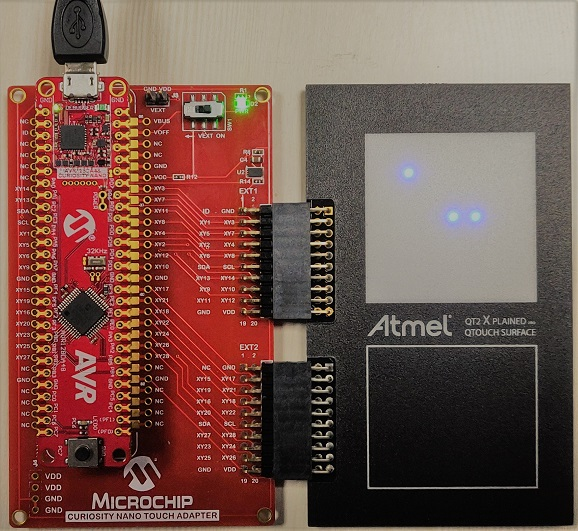

## Objective:
This example consists a basic ‘Snake Game Demo’ implemented to demonstrate the 2D touch surface gestures with the help of Microchip® AVR128DA48 Curiosity Nano and QT2 Xplained Pro extension boards. This application example showcases the advanced touch capabilities of ‘PTC’ peripheral, and low power capabilities of the AVR-DA MCUs.

## Related Application Note:
[2D Gesture Implementation with Capacitive Touch Surface Using AVR-DA Microcontroller](https://microchip.com/DS00003433)

## Peripherals Involved:
1. Peripheral Touch Controller (PTC)
2. Event System
3. SLPCTRL
4. TWI – I2C mode
5. Real Time Counter (RTC)
6. CPUINIT

## Hardware Setup for the Snake game demo using Curiosity nano and QT2 Xplained Pro: 

## Running the Demo in ATMEL Studio:
1.	Press DOWNLOAD SELECTED EXAMPLE in the example browser, or click EXPORT PROJECT -> DOWNLOAD PACK from within START and save the .atzip file.
2.	Import .atzip file into Atmel Studio 7, by clicking File->Import->Atmel Start Project.
3.	Build the application and program the device.
4.	Press Start without debugging or use CTRL+ALT+F5 hotkeys to run the application.
5.	Snake game will start on the QT2 Led matrix.
6.	Use touch surface on QT2 to steer the snake towards food.
7.	After 20 seconds of inactivity MCU will go to sleep.
8.	Tap the touch surface anywhere to wake-up the MCU.
